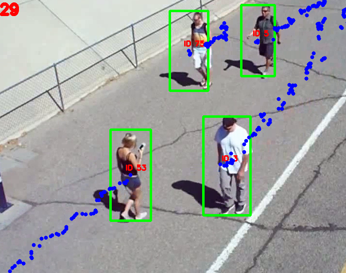

# WonderTree Test
Person Tracking
Open object_detection_tutorial.ipynb and run the whole notebook. 
This notenbook is almost similar to the tensorflow object detection api tutorial except the last two cells which have all the functionality for person tracking.
.

  

